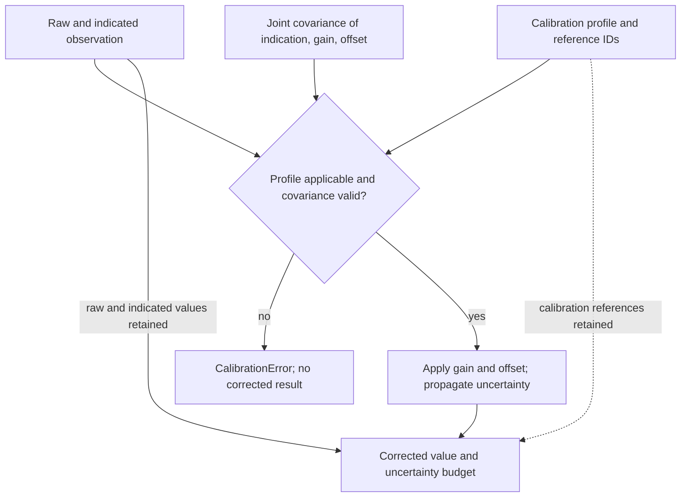

# Calibration

**Apply declared measurement calibration and retain the full first-order uncertainty budget.**

| NET micro-tool | Identity and scope |
| --- | --- |
| User-facing name | **Calibration** |
| Proposed NET operation | `measure.calibrate` |
| Implementation repository | `Metrological-Calibration-Uncertainty-Runtime` |
| Existing provider and import | Metrological Calibration and Uncertainty Runtime / MCUR; `mcur` |
| Existing operation | `mcur.affine-first-order.v1` |
| Current boundary | Apply a declared affine calibration and propagate joint uncertainty; no calibration-fitting or certificate-issuing service |

`measure.calibrate` is the agreed NET-facing operation target, **not a newly
installed command or an implemented hardware adapter**. Use the existing `mcur`
API and examples below. Raw, indicated and corrected values remain separate;
reference IDs do not by themselves establish metrological traceability.

NET owns session composition and dispatch; this provider owns calibration
applicability and measurement-specific uncertainty propagation. **Sensor Adapter**
retains the measurement-chain boundary and **Sensitivity** retains general
Jacobian operations. Evidence, operation specifications, execution attempts and
verification records remain distinct. Repository URLs, imports, operation IDs,
contracts, historical pins and licence terms are unchanged.

[Notations Engineering Terminal (CIW)](https://github.com/giasonpooni/Notations-Engineering-Terminal) · [Stack placement and ownership](docs/STACK.md) · [Diagram atlas](https://github.com/giasonpooni/Notations-Engineering-Terminal/blob/main/docs/DIAGRAMS.md) · [License](LICENSE)

MCUR is a bounded scientific instrument for applying a declared affine measurement calibration and propagating its joint uncertainty. It keeps the raw observation, indicated value, corrected value, calibration evidence references, applicability checks, and uncertainty budget distinct.




Solid arrows show implemented checks, arithmetic, and retained values. The dotted arrow carries declared calibration references; it is not a certified traceability chain or a live integration.

The implemented operation is `mcur.affine-first-order.v1`:

\[
y=gx+b,\qquad J=[g,\;x,\;1],\qquad u_y^2=J\Sigma_{[x,g,b]}J^T.
\]

The complete ordered covariance includes correlation between the indication, gain, and offset. Calibration coefficient covariance is pinned in the profile and must equal the corresponding block in the supplied joint covariance.

## Organization

**Notation Systems Inc** is the parent organization: a scientific computing and systems engineering company developing computational instruments, software and interactive environments for understanding and building physical and virtual systems.

The company's development direction connects measurement, state estimation and sensor fusion, scientific modelling, simulation and execution, from materials and machines to interactive worlds.

| Division | Focus |
| --- | --- |
| **Notations Gaming** | Games, graphics, world building, interactive environments and gameplay simulation. |
| **Notations Manufacturing** | Design, machinery integration, process development, fabrication and production systems. |
| **Notations Laboratories** | Research and experimental validation in scientific computing, measurement, physics and chemistry modelling, materials and simulation. |

**Repository role:** Calibration is a **Notations Laboratories** measurement instrument for declared affine corrections, applicability checks and first order joint uncertainty budgets. It supplies a bounded calibration step for the company's broader measurement and state estimation direction; physical use still requires application specific calibration evidence.

## Status and scope

This repository contains an executable Python foundation, synthetic replay, analytical and adversarial tests, and optional export into the existing State Estimation Evaluation Testbed (SET) result contract. It does not contain a physical sensor integration, calibration fitting service, calibration certificate issuer, or operational admission controller.

Current behavior:

- Check sensor, quantity, input unit, acquisition-time validity, indicated-value range, and declared environmental applicability.
- Preserve raw and indicated values while returning a separate corrected value and first-order uncertainty budget.
- Accept correlations, negative covariance contributions, and exactly positive-semidefinite singular matrices.
- Reject nonfinite, asymmetric, or indefinite covariance, including very small numerical scales; never clip eigenvalues or silently symmetrize inputs.
- Retain optional reported serving status separately from validity at acquisition time.
- Export a caller-mapped result with distinct operation, execution, input, result, and verification identities through SET's existing `notation.instrument.result-artifact.v1` contract.

The calibration is affine in `x` for fixed coefficients, but `g*x` is jointly nonlinear when both are uncertain. The reported uncertainty is a first-order approximation. Supplied reference IDs are evidence pointers; their presence does not establish certified metrological traceability.

## Run

Requires Python 3.11 or later.

```bash
python -m pip install -e '.[test]'
python -m pytest -q
python examples/replay.py
```

The synthetic replay has `raw=300`, `indicated=3 kPa`, `g=2`, and `b=1 kPa`. It returns `corrected=7 kPa` and variance `22.35 kPa²`, including all covariance terms.

For the pinned SET conformance example:

```bash
python -m pip install -e '.[test,exchange]'
python -m pytest -q
python examples/exchange.py
```

The optional dependency is pinned to SET commit `bd261a765281a95312f7c91a3857233476294c5b`. Base installations skip exchange tests when SET is absent; CI installs both extras. The example's all-zero source revision is explicitly synthetic and unattested. A real caller must supply its actual source commit and execution reference. Contract conformance neither attests that commit nor verifies physical calibration.

## Public API

```python
from mcur import CalibrationProfile, JointCovariance, Observation, calibrate

result = calibrate(observation, profile, joint_covariance)
```

`Observation`, `CalibrationProfile`, `JointCovariance`, and `CalibrationResult` are immutable typed records. `Interval`, `EnvironmentReading`, and `EnvironmentRequirement` express applicability. `ServingStatus` carries a caller-reported `ServingState` independently of acquisition-time validity. Invalid scientific inputs raise `CalibrationError`.

The complete examples demonstrate concrete record construction. The optional `mcur.exchange.export_result` helper deliberately requires an explicit scientific-to-contract mapping.

## System boundary

| Neighbor | Relationship |
| --- | --- |
| Data Intake / Provenance-Preserving Data Acquisition (PPDA) | Retains source bytes and extraction lineage. MCUR consumes a referenced observation and never rewrites that evidence. |
| Sensor Adapter / RCI | Retains its acquisition and measurement boundary. MCUR provides reusable calibration profile and propagation math; no RCI replacement or native adapter is implemented here. |
| Sensitivity / Jacobian Sensitivity Propagation Testbed (JSPT) | Generalized sensitivity and uncertainty propagation remain separate from this measurement-specific calibration operation. |
| Geometric State Inference Engine (GSIE) | May consume the corrected measurement and candidate uncertainty through an explicit mapping. MCUR does not infer plant state or certify estimator adequacy. |
| Estimator Bench / SET | Owns the existing exchange contract and external conformance validation. |
| [Notations Engineering Terminal (CIW)](https://github.com/giasonpooni/Notations-Engineering-Terminal) / State Ledger (ESM) | Bind evidence, executions, results, verification, and admission under their own authority. This repository has no native CIW adapter and grants no admission or actuation authority. |

See [the contract](docs/CONTRACT.md), [numerical semantics](docs/NUMERICS.md), and [stack role](docs/STACK_ROLE.md).

## License

Mozilla Public License 2.0. See [LICENSE](LICENSE).
